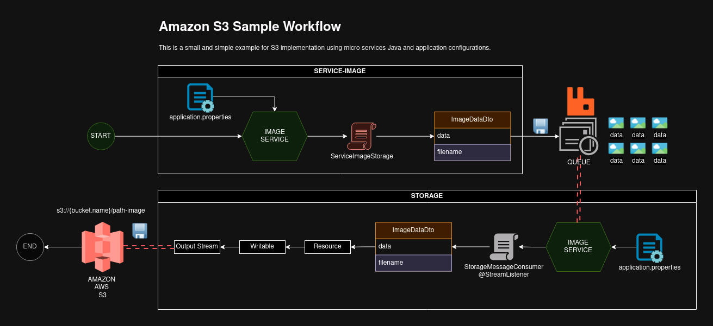
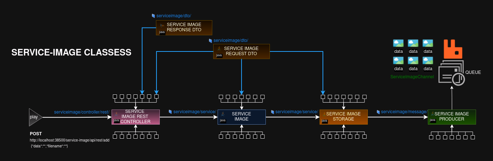
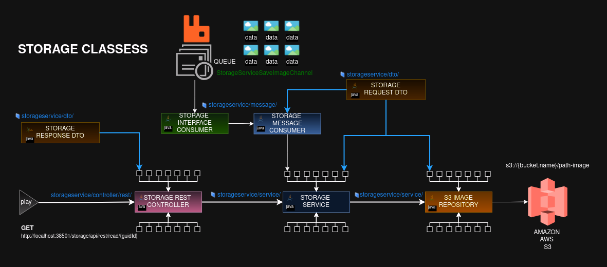

# S3 Rabbitmq Service-Image
Work With S3 RabbitMQ + Java (Spring Boot)

# How to work

This project is a simple and small usage representation of Amazon S3 + RabbitMQ where we can see one JAVA service 
consuming and producing the input and output data into RabbitMQ Queue and S3 Bucket Storage.

The SERVICE-IMAGE (sample in this project) receive a HTTP Rest Request via API contained the fields data and filename, 
where data is the image file in base64, next this image is saved in the RabbitMQ queue to waiting the next process.

The next process is executed by STORAGE (storage-service) that get all messages in the queue and process according 
to the goal in this project. In resume this process will send the image that was got in the queue to S3 bucket. It is 
made using a "Resource" from native library Java. 

To offer more details about the project work, follow the simple but helpful diagram where we can see the all classes 
and your relationship, since the HTTP Rest Request until the save in the RabbitMQ. These images represent the 
SERVICE-IMAGE and STORAGE services, where we can see and realize that each one works separated and alone.

# Step by Step

To implement this repository in your projects use the following instructions

- Get the repository

<pre>
git clone https://github.com/huntercodexs/s3-rabbitmq-service-image.git
</pre>

- Open in your preferred IDE

<pre>
[IntelliJ]
- Check the Project Structure to see if is configured correctly
Menu[File] -> SubMenu[Project Structure] -> Item[Modules]

- Check if the Java version is 1.8 or later
</pre>

- Check the pom.xml dependencies for SERVICE-IMAGE module

<code>

    <!--SPRING BOOT-->
    <dependency>
        <groupId>org.springframework.boot</groupId>
        <artifactId>spring-boot-starter-web</artifactId>
    </dependency>

    <!--ACTUATOR-->
    <dependency>
        <groupId>org.springframework.boot</groupId>
        <artifactId>spring-boot-starter-actuator</artifactId>
    </dependency>

    <!--RABBITMQ/STREAM-->
    <dependency>
        <groupId>org.springframework.cloud</groupId>
        <artifactId>spring-cloud-starter-stream-rabbit</artifactId>
    </dependency>
    <dependency>
        <groupId>org.springframework.cloud</groupId>
        <artifactId>spring-cloud-stream-test-support</artifactId>
        <scope>test</scope>
    </dependency>

    <!--LOMBOK-->
    <dependency>
        <groupId>org.projectlombok</groupId>
        <artifactId>lombok</artifactId>
        <scope>provided</scope>
    </dependency>

</code>

- Check the pom.xml dependencies for STORAGE module

<code>

    <!--SPRING BOOT WEB-->
		<dependency>
			<groupId>org.springframework.boot</groupId>
			<artifactId>spring-boot-starter-web</artifactId>
		</dependency>

		<!--ACTUATOR-->
		<dependency>
			<groupId>org.springframework.boot</groupId>
			<artifactId>spring-boot-starter-actuator</artifactId>
		</dependency>

		<!--RABBITMQ-->
		<dependency>
  			<groupId>org.springframework.cloud</groupId>
  			<artifactId>spring-cloud-starter-stream-rabbit</artifactId>
		</dependency>

		<!--LOMBOK-->
		<dependency>
			<groupId>org.projectlombok</groupId>
			<artifactId>lombok</artifactId>
			<optional>true</optional>
		</dependency>

		<!--AWS-->
 		<dependency>
	        <groupId>org.springframework.cloud</groupId>
	        <artifactId>spring-cloud-starter-aws</artifactId>
    	</dependency>

		<!--TOOLS-->
		<dependency>
			<groupId>commons-lang</groupId>
			<artifactId>commons-lang</artifactId>
			<version>2.6</version>
		</dependency>
		<dependency>
			<groupId>commons-io</groupId>
			<artifactId>commons-io</artifactId>
			<version>2.5</version>
		</dependency>

</code>

In this case have attention with the AWS dependence like this (it will be used int the Resources to connect at 
Amazon Service S3)

<code>

		<!--AWS-->
 		<dependency>
	        <groupId>org.springframework.cloud</groupId>
	        <artifactId>spring-cloud-starter-aws</artifactId>
    	</dependency>

</code>

- Check the application properties

> NOTE: The application properties should have the settings to RabbitMQ access and control and also to access the Bucket S3

###### Image Service

<pre>
# SPRING RABBITMQ
#----------------------------------------------------------------------------------------------------------------
spring.rabbitmq.host={RABBIT-IP-ADDRESS}
spring.rabbitmq.port={RABBIT-PORT}
spring.rabbitmq.username={RABBIT-USER}
spring.rabbitmq.password={RABBIT-USER}

# SPRING CLOUD STREAM
#----------------------------------------------------------------------------------------------------------------
spring.cloud.stream.bindings.ServiceImageChannel.destination={RABBIT-QUEUE-NAME}
spring.cloud.stream.bindings.ServiceImageChannel.group={RABBIT-EXCHANGE-NAME}
</pre>

###### Storage

<pre>
# BUCKET
#----------------------------------------------------------------------------------------------------------------
bucket.name={S3-BUCKET-NAME}
cloud.aws.stack.auto=false
cloud.aws.region.static={S3-REGION}
cloud.aws.credentials.accessKey={ACCESS-KEY}
cloud.aws.credentials.secretKey={SECRET-KEY}

# SPRING RABBITMQ
#----------------------------------------------------------------------------------------------------------------
spring.rabbitmq.host={RABBIT-IP-ADDRESS}
spring.rabbitmq.port={RABBIT-PORT}
spring.rabbitmq.username={RABBIT-USER}
spring.rabbitmq.password={RABBIT-USER}

# SPRING CLOUD STREAM
#----------------------------------------------------------------------------------------------------------------
spring.cloud.stream.bindings.StorageServiceSaveImageChannel.destination={RABBIT-QUEUE-NAME}
spring.cloud.stream.bindings.StorageServiceSaveImageChannel.group={RABBIT-EXCHANGE-NAME}
</pre>

- Request add Image (see the Test section below)
- Request read Image (see the Test section below)

# Test

Use the following tests case below to check the project work: 

- Add Image

> NOTE: The guid field in the response should be used to read the image if necessary when read image is called

<pre>
POST
http://localhost:38500/service-image/api/rest/add
BODY-REQUEST {
    "data": "{{Base64Image}}",
    "filename": ""
}
RESPONSE {
    202 - HTTP STATUS ACCEPTED
    {
        "guid": "fda9e746-05e9-4d9c-9e22-86ad460ca09"
    }
}
</pre>

- Read Image

<pre>
GET
http://localhost:38501/storage/api/rest/read/fda9e746-05e9-4d9c-9e22-86ad460ca09
RESPONSE {
    200 - HTTP STATUS OK
    {
        "file": "{Base64Image}"
    }
}
</pre>
